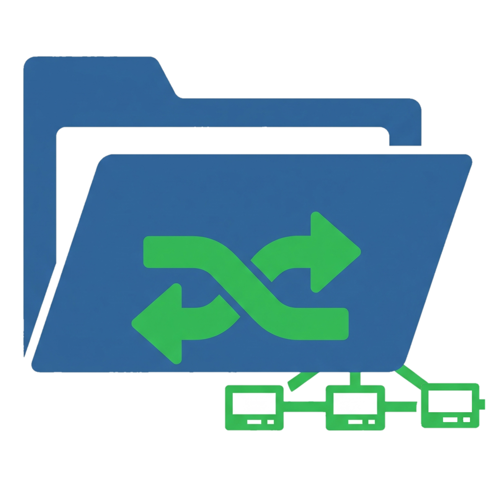

<p align="center">
  
</p>

# LAN File Sharing App

A simple web-based file sharing tool that lets you upload files across multiple computers connected to the same LAN (Local Area Network).  
Works over Wi-Fi or Ethernet — no internet required, no WhatsApp, no USB drives!

## 🔧 Features

- Upload files from one PC to another on the same network
- Files are saved locally in the `uploads/` folder
- No admin or root access needed
- Lightweight and fast — built using Node.js and Express

## 🚀 Getting Started

### 1. Clone the repository

```bash
git clone https://github.com/your-username/lan-file-share.git
cd lan-file-share
````

### 2. Install dependencies

```bash
npm install
```

### 3. Run the app

```bash
node server.js
```

Make sure your server listens on all interfaces:

```js
app.listen(3000, '0.0.0.0');
```

### 4. Access from another PC

On any computer connected to the same LAN, open a browser and go to:

```
http://<your-local-ip>:3000
```

Find your local IP using:

```bash
hostname -I
```

## 📁 Folder Structure

```
├── uploads/           # Stores received files
├── views/
│   └── homepage.ejs   # Upload form
├── server.js          # Main server file
└── logo.png           # Your logo image
```

## 📷 Screenshot


## 🧰 Tech Stack

* Node.js
* Express.js
* Multer (file upload middleware)
* EJS (template engine)

## 📜 License

MIT License

```
